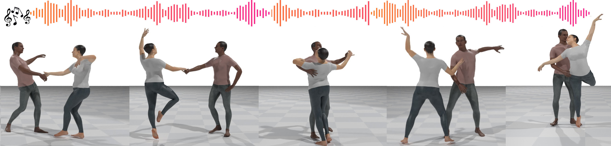

# DuetGen: Music Driven Two-Person Dance Generation via Hierarchical Masked Modeling [**SIGGRAPH 2025**]


*DuetGen generates synchronized two-person dance choreography from input music, featuring natural and close interactions between dancers.*


<p align="center">
  <a href='https://arxiv.org/abs/your_paper_id'>
    </a>
  <a href='https://anindita127.github.io/DuetGen'>
    </a>
</p>


## Codebase

### Pre-requisites
We have tested our code on the following setups: 
* Ubuntu 20.04 LTS
* Windows 10, 11
* Python >= 3.8
* Pytorch >= 1.11
* conda >= 4.9.2 (optional but recommended)

### Getting started

Follow these commands to create a conda environment:
```
conda create -n duet python=3.8
conda activate duet
conda install pytorch==1.7.0 torchvision==0.8.0 torchaudio==0.7.0 cudatoolkit=10.1 -c pytorch
pip install -r requirements.txt
```

1. Download DD100 dataset from [Duolando website](https://lisiyao21.github.io/projects/Duolando/) and save the downloaded data in the path: '../Datasets/DD100'.

2. To pre-process the DD100 dataset for our setting, run: 
```
	i. python dataset_preparation/_train_test_split.py
```
The above code separates the full dataset into training and test sets. This is created following the [original codebase](https://github.com/lisiyao21/Duolando/blob/main/_train_test_split.py).
```
	ii. python dataset_preparation/_prepare_aligned_motion_music.py
```
The above code will create two folders under 'data/DD100'. The folders are named 'train_fullsequence' and 'test_fullsequence' and consists of numpy files with the aligned motion and music pairs.
```
	iii. python dataset_preparation/_prepare_data_windows.py
```
The above code will generate training and test samplesof 128 frames and 400 frames inside the respective folders '128_32' and '400_100' under 'data/DD100'. The data is also augmented by mirroring Person 1 and Person 2's motion.
```
	iv. python dataset_preparation/_calculate_mean_variance.py
```
The above code generates the mean and variance from the full dataset for Z normalization.

3. To train the vqvae for motion tokenization, run:
```
python train/train_motion_vqvae_music.py (is_train=True, load_exp=None)
```
   
4. To train the masked transformer for the generation of top-codes, run:
```
python train/train_music2motion_topcode_token.py (is_train=True, load_exp=None)
```
This has to be trained before training the bottom-codes. 

5. To train the masked transformer for the generation of bottom-codes, put the path of the trained top-code masked transformer model weights in the variable *topcode_transformer_weight_path* in `args_masked_transformer_bottom.py` and then run:
```
python train/train_music2motion_bottomcode_token.py (is_train=True, load_exp=None)
```

6. To train the trajectory refinement module, run:
```
python train/train_trajectory_from_local.py (is_train=True, load_exp=None)
```

7. To generate the predicted motion samples as pkl files from the trained models, run:
```
python test/predict_motion_samples.py 
(load_exp = 'checkpoints/DD100/masked_transformer/<exp_name_for_Music2Motion_combined_hier_bottom>/<epoch>/weights.p', traj_pred_model_pretrained_weight_path='checkpoints/DD100/extra_motion/<exp_name_for_Global_Trajectory_Pred>/<epoch>/weights.p')
```

### Download pre-trained model weights 
You can download trained model weights from this [link](https://drive.google.com/file/d/15v9CJceWTfGfkwlhUGGYUfuHqAaFPPFC/view?usp=sharing).


## Citation

```bibtex
@InProceedings{ghosh2025duetgen,
    title={DuetGen: Music Driven Two-Person Dance Generation via Hierarchical Masked Modeling},
    author={Ghosh, Anindita and Zhou, Bing and Dabral, Rishabh and Wang, Jian and Golyanik, Vladislav and Theobalt, Christian and Slusallek, Philipp and Guo, Chuan},
    booktitle={SIGGRAPH},
    year={2025}
}
```
## License

**Snap Inc. Non-Commercial License**  
Copyright (c) 2025 Snap Inc. All rights reserved.  
This sample code is made available by Snap Inc. for non-commercial, research purposes only.  
Non-commercial means not intended for or directed towards commercial advantage or monetary compensation. Research purposes mean solely for academic study, instruction, or non-commercial research, testing or validation.
No commercial license, whether implied or otherwise, is granted in or to this sample code or any related patents, unless you have entered into a separate agreement with Snap Inc. for such rights.  
This sample code is provided as-is, without warranty of any kind, express or implied, including any warranties of merchantability, title, fitness for a particular purpose, non-infringement, or that the code is free of defects, errors or viruses. In no event will Snap Inc. be liable for any damages or losses of any kind arising from this sample code or your use thereof.
Any redistribution of this sample code, including in binary form, must retain or reproduce this license text including all copyright notices, conditions and disclaimers.

Find the full license [here](https://github.com/anindita127/DuetGen/blob/main/LICENSE_DuetGen.pdf).

